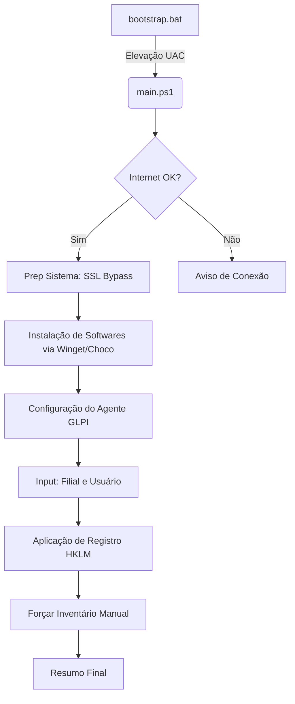

# Windows Post-Install Suite

**Objetivo do Projeto**: Este repositório contém uma suíte de scripts modular, automatizada e de fácil manutenção projetada para a configuração pós-instalação de estações de trabalho Windows 11. Ele combina gerenciamento de privilégios administrativos, ajustes de sistema, implantação do Agente GLPI e instalação de softwares em massa via `winget`.

---

## 🚀 Como Usar

1.  **Baixe** ou **Clone** este repositório na máquina alvo (ou em um Pen Drive).
2.  **Edite o arquivo `credentials.txt`** (opcional) se precisar alterar o servidor GLPI ou usuário/senha.
3.  **Clique duas vezes** em `bootstrap.bat`.
4.  **Confirme** a solicitação do Controle de Conta de Usuário (UAC) para permitir privilégios de Administrador.
5.  **Siga as instruções na tela**:
    -   O script verificará a conexão com a internet automaticamente.
    -   Digite a **FILIAL** (ex: MATRIZ).
    -   Digite o **USUÁRIO** (ex: joao.silva).
    -   Confirme a TAG gerada.
6.  **Aguarde** a conclusão da instalação. O script instalará a lista padrão de softwares corporativos (incluindo o Agente GLPI) e realizará a configuração final.

---

## 🔄 Fluxo de Execução



---

## 📂 Estrutura do Projeto

O projeto está organizado em uma estrutura modular para facilitar a manutenção e atualizações.

```
/ (Raiz)
├── bootstrap.bat             # Ponto de entrada. Gerencia elevação e inicia o PowerShell.
├── credentials.txt           # Arquivo de configuração (Servidor GLPI, Usuário, Senha).
├── software_list.json        # Lista de pacotes para instalação (Winget/MSStore).
├── src/
    ├── main.ps1              # Script orquestrador principal.
    └── modules/
        ├── sys_utils.ps1     # Utilitários (Internet Check, Fix SSL, Leitura de Credenciais).
        ├── glpi_installer.ps1 # Configuração e Registro do Agente GLPI.
        └── software_deploy.ps1 # Motor de instalação de softwares (Winget com fallback Choco).
```

---

## 🛠 Manutenção e Personalização

### Configuração do GLPI (`credentials.txt`)
O arquivo `credentials.txt` permite alterar o servidor sem mexer no código:
```ini
GLPI_SERVER=http://glpi.suaempresa.com/front/inventory.php
GLPI_USER=glpi_user
GLPI_PASSWORD=glpi_password
```

### Adicionando ou Removendo Softwares
Para modificar a lista de aplicativos instalados:
1.  Abra `software_list.json`.
2.  Adicione ou remova objetos JSON seguindo o padrão (Id, Source, ChocoId).

---

## 🔍 Solução de Problemas

-   **Sem Internet**: O script avisa no início se não houver conexão com o Google DNS (8.8.8.8).
-   **WhatsApp Falhando**: O script executa `winget source update` automaticamente para corrigir erros de catálogo da MS Store.
-   **Fallback**: Se um pacote falhar no Winget e possuir um `ChocoId` no JSON, o script tentará instalá-lo via Chocolatey.

---

**Autor**: Daniel Wppslander (@wppslander)
